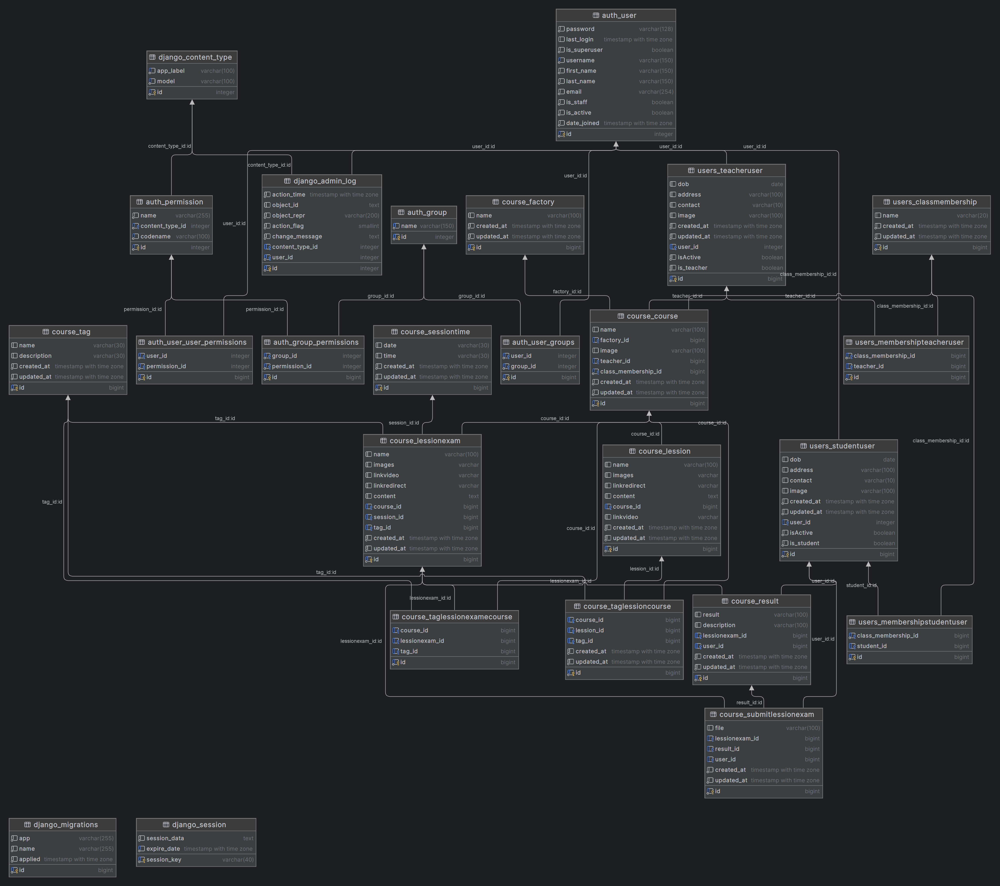

# Project course

## Step 1: Create project 

    django-admin startproject course2023

## Step 2: Host postgresql

    docker-compose up

## Step 3: Code

    python -m pip install pandas

# Run project

    python manage.py flush
    python manage.py makemigrations
    python manage.py migrate
    python manage.py createsuperuser
    python manage.py runserver

    python manage.py startapp ...

# Data digram

# Push image to docker hub

    docker tag course2023master:latest dangnguyensonia/course2023master
    docker push dangnguyensonia/course2023master

## Change to run database in docker
DATABASES = {
    'default': {
        'ENGINE': 'django.db.backends.postgresql_psycopg2',
        'NAME': 'course',
        'USER': 'course',
        'PASSWORD': 'course',
        'HOST': '127.0.0.1',
        'PORT': '5432',
    }
}

